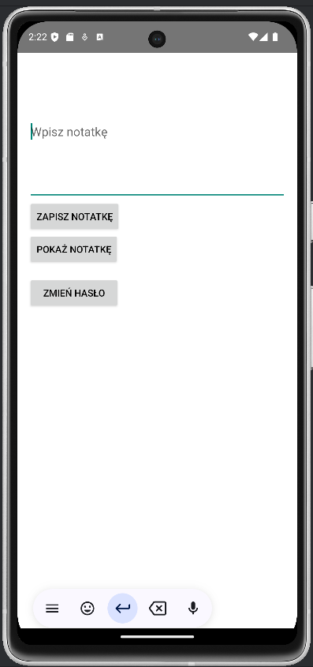
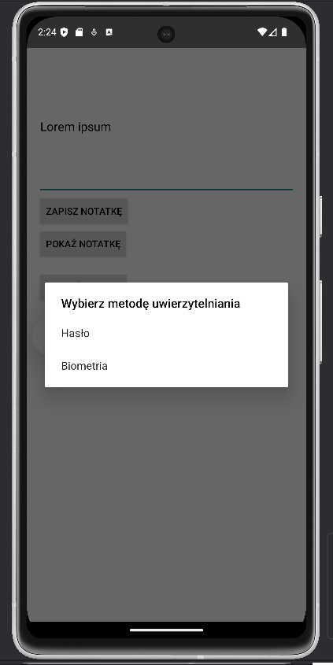
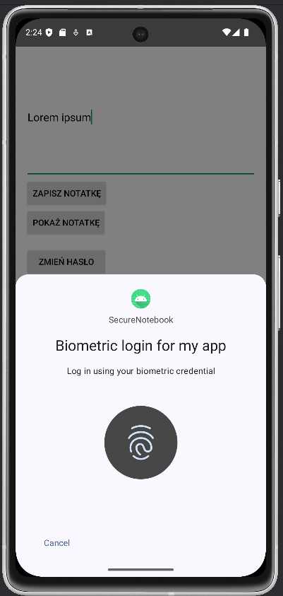

# 🔒 SecureNote
SecureNote to aplikacja mobilna na Androida do bezpiecznego przechowywania notatek. Wykorzystuje szyfrowanie i zaawansowane mechanizmy ochrony danych.

# Screenshots:

## ✨ Funkcjonalności
* 📝 **Dodawanie, edytowanie i usuwanie notatek**
* 🔑 **Zabezpieczenie dostępu do aplikacji** (PIN, odcisk palca)
* 🔒 **Szyfrowanie danych w pamięci aplikacji**

## 🛡 Zabezpieczenia
* **Szyfrowanie Notatek** – Notatki są szyfrowane algorytmem **AES-GCM z losowym IV**. Klucz przechowywany w Android Keystore.
* **Hashowanie haseł** – Hasła są haszowane przy użyciu **PBKDF2WithHmacSHA256**
* **Mechanizm blokowania** – Jeśli użytkownik 3 razy poda błędne hasło, aplikacja zapisuje czas blokady i uniemożliwia logowanie przez 1 minutę.
* **Uwierzytelnianie biometryczne** – Za pomocą odcisku palca, używane do zapisu/odczytu notatki oraz zmiany hasła.
* **Przechowywanie informacji** - 
  **EncryptedSharedPreferences** służy do przechowywania:
  * Hasła użytkownika (w postaci zahaszowanej),

  * Soli do haszowania,

  * Zaszyfrowanej notatki,

  * Licznika nieudanych prób logowania.

## 🛠 Technologie
* **Kotlin** 
* **Gradle**  
* **EncryptedSharedPreferences** 
*  **Biometric Authentication**
